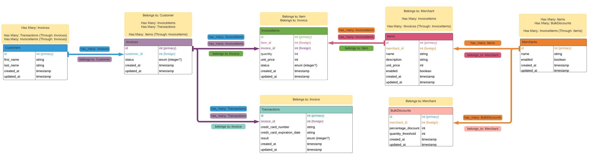

# Little Esty Shop Bulk Discounts

[![Contributors][contributors-shield]][contributors-url]
[![Forks][forks-shield]][forks-url]
[![Stargazers][stars-shield]][stars-url]
[![Issues][issues-shield]][issues-url]

Link to Live Application: [Little Esty Shop Bulk Discounts](https://shielded-basin-82582.herokuapp.com/)

## Table of Contents

- [Overview](#overview)
- [Learning Goals](#learning-goals)
- [Tools Used](#tools-used)
- [Database Schema](#database-schema)
- [Getting Started](#getting-started)
- [Contributors](#contributors)

## Overview

[Little Esty Shop Bulk Discounts](https://github.com/Scott-Borecki/little_esty_shop_bulk_discounts) is a 7-day, final solo project during Mod 2 of 4 for Turing School's Back End Engineering Program.  This project builds off the Mod 2 group project, [Little Esty Shop](https://github.com/turingschool-examples/little-esty-shop).

Little Esty Shop is an e-commerce platform where Merchants and Admins can manage inventory and fulfill customer invoices.  The Bulk Discounts extension consisted of adding functionality for merchants to create bulk discounts for their items.  A "bulk discount" is a discount based on the quantity of items the customer is buying (e.g. 20% off orders of 10 or more items).

## Learning Goals

Learning goals and areas of focus consisted of:

- Practice designing a normalized database schema, defining model relationships, and writing migrations to create tables and relationships between tables.
- Use MVC to organize code effectively, limiting the amount of logic included in views and controllers.
- Implement CRUD functionality for a resource using forms, buttons, and links.
- Use advanced routing techniques, including namespacing, to organize and group like functionality together.
- Use built-in ActiveRecord methods to join multiple tables of data, make calculations, group data based on one or more attributes, and perform complex database queries.
- Write model tests that fully cover the data logic of the application.
- Write feature tests that fully cover the functionality of the application.
- Practice consuming public APIs while utilizing POROs as a way to apply OOP principles to organize code.

Little Esty Shop project requirements: [link](https://github.com/turingschool-examples/little-esty-shop) 
Bulk Discounts project requirements: [link](https://backend.turing.edu/module2/projects/bulk_discounts)

## Tools Used

### Framework

  

### Languages

  
  
  
  
  

### Tools

    
  
  
  
    

    

#### Gems

  
  
  
  
    

    
    
    
  
    

  
    
    
    

### Processes

  
  
  
    

## Database Schema

## Contributors

👤  **Scott Borecki**
- Github: [Scott-Borecki](https://github.com/Scott-Borecki)
- LinkedIn: [Scott Borecki](https://www.linkedin.com/in/scott-borecki/)

<!-- MARKDOWN LINKS & IMAGES -->

[contributors-shield]: https://img.shields.io/github/contributors/Scott-Borecki/little_esty_shop_bulk_discounts.svg?style=flat-square
[contributors-url]: https://github.com/Scott-Borecki/little_esty_shop_bulk_discounts/graphs/contributors
[forks-shield]: https://img.shields.io/github/forks/Scott-Borecki/little_esty_shop_bulk_discounts.svg?style=flat-square
[forks-url]: https://github.com/Scott-Borecki/little_esty_shop_bulk_discounts/network/members
[stars-shield]: https://img.shields.io/github/stars/Scott-Borecki/little_esty_shop_bulk_discounts.svg?style=flat-square
[stars-url]: https://github.com/Scott-Borecki/little_esty_shop_bulk_discounts/stargazers
[issues-shield]: https://img.shields.io/github/issues/Scott-Borecki/little_esty_shop_bulk_discounts.svg?style=flat-square
[issues-url]: https://github.com/Scott-Borecki/little_esty_shop_bulk_discounts/issues
